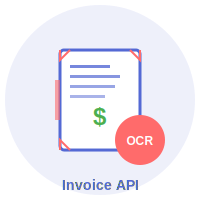

# Microservice Logo System

## Pattern for All Cadejo Dido Microservices

Each microservice gets a customized logo following this pattern:

### 1. Base Logo (Your Cadejo Dido Logo)
- Always use the white transparent version as the foundation
- Keep the core branding consistent

### 2. Service-Specific Overlay
Each service adds relevant visual elements:

#### Invoice OCR API
- 📄 Document icon with scan lines
- 💲 Dollar sign for financial data
- 🔍 Scanner effect animation
- Color: Purple (#5469d4) + Red accents (#FF6B6B)

#### Future Services Examples:

**Email Parser API**
- ✉️ Envelope with extraction arrows
- 📊 Data flow visualization
- Color: Blue (#4285F4) + Green accents

**Meeting Transcription API**
- 🎤 Microphone with text bubbles
- 📝 Text streaming effect
- Color: Orange (#FF6500) + Blue accents

**Social Media Formatter API**
- 📱 Multiple platform icons
- ➡️ Transformation arrows
- Color: Pink (#E1306C) + Multiple platform colors

### 3. Badge System
Each logo includes:
- Service abbreviation badge (e.g., "OCR", "EMAIL", "MEET")
- API label at bottom
- Consistent positioning (bottom-right corner)

### 4. Animation (for web use)
- Subtle scanning/processing effect
- Service-specific motion (scan lines, data flow, etc.)
- 3-second loop

## Implementation Guide

```html
<!-- Usage in your landing page -->
<div class="logo-container">
  
  <!-- Or use your PNG base + overlay -->
  <div class="logo-wrapper">
    
    <div class="service-overlay invoice-ocr"></div>
  </div>
</div>
```

```css
/* Consistent styling across all services */
.service-logo {
  width: 120px;
  height: 120px;
  animation: pulse 3s infinite;
}

.service-overlay.invoice-ocr::before {
  content: "📄";
  position: absolute;
  font-size: 40px;
  /* Specific positioning for invoice service */
}
```

## File Naming Convention
- `logo-invoice-ocr.svg` - Invoice OCR API
- `logo-email-parser.svg` - Email Parser API
- `logo-meeting-transcript.svg` - Meeting Transcription API
- etc.

This system ensures brand consistency while clearly differentiating each microservice!